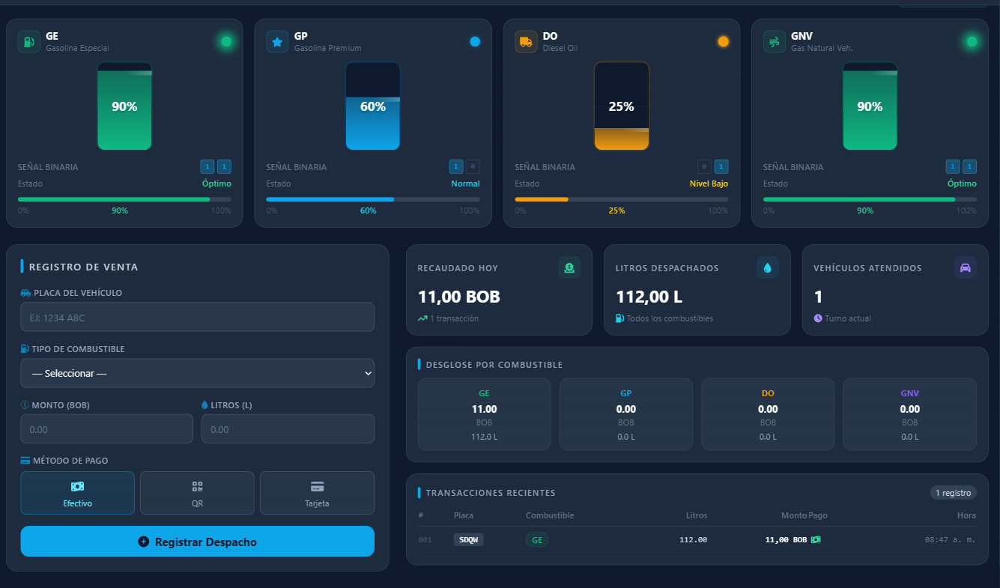
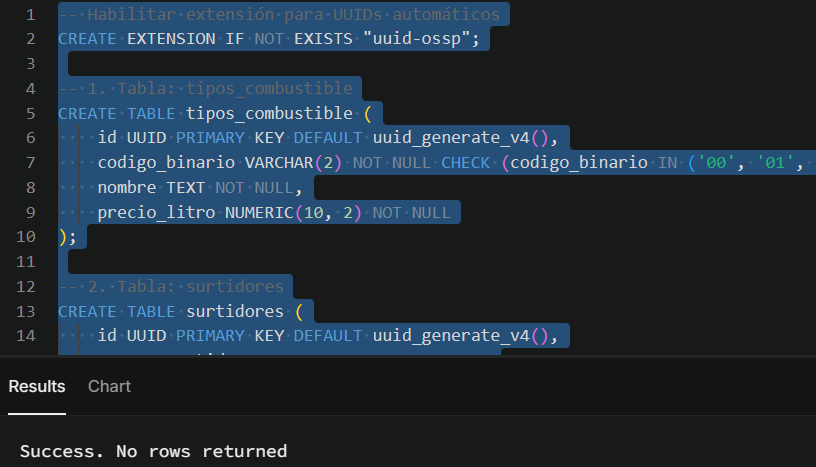
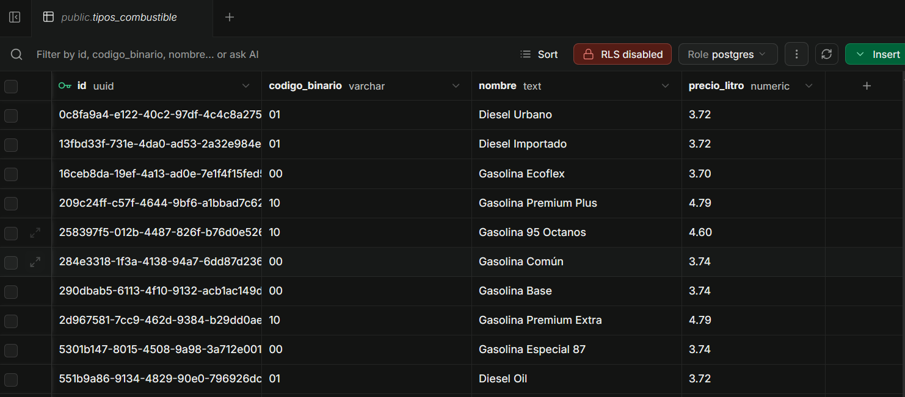
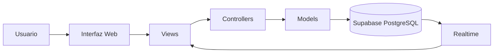

<div align="center">

# ⛽ SURTIRSOFT COCHA

### Sistema Inteligente de Gestión y Monitoreo para Estaciones de Servicio



<br>


</div>

---

# 📖 Descripción

**SURTIRSOFT COCHA** es un sistema web industrial desarrollado para la administración integral de una estación de servicio.

La plataforma permite supervisar en tiempo real el estado de tanques, surtidores, inventarios, ventas, reportes financieros, usuarios y configuraciones del sistema desde una única interfaz tipo **SCADA**, ofreciendo una experiencia moderna, rápida e intuitiva.

El proyecto integra tecnologías web actuales junto con fundamentos de **Sistemas Digitales**, implementando lógica binaria para el monitoreo de niveles de combustible, alertas inteligentes y una arquitectura basada en el patrón **Modelo – Vista – Controlador (MVC)**.

Además incorpora tecnologías modernas como **Supabase**, **Web Speech API**, **Progressive Web App (PWA)** y sincronización **Realtime**, convirtiéndolo en una plataforma preparada para escenarios reales de operación.

---

# 🚀 Demo del Proyecto

### 🌐 Sistema desplegado

> https://surtidor-digital-cochabamba.vercel.app/

---

### 🎨 Prototipo UI

> https://uxpilot.ai/s/a59911d947824f8b6347613638a7b69e

---

# 🎯 Objetivo General

Desarrollar una plataforma inteligente para automatizar la administración de una estación de servicio mediante herramientas modernas de desarrollo web, integrando monitoreo en tiempo real, sistemas digitales, almacenamiento en la nube y una interfaz industrial de alto rendimiento.

---

# ✨ Características Principales

## 🏭 Gestión Industrial

- Dashboard tipo SCADA
- Monitoreo en tiempo real
- Control de tanques
- Control de surtidores
- Alertas inteligentes
- Registro de eventos

---

## 💰 Gestión Comercial

- Registro de ventas
- Historial completo
- Reportes financieros
- Ticket promedio
- Volumen despachado
- Estadísticas

---

## 👥 Administración

- Login seguro
- Gestión de usuarios
- Configuración del sistema
- Gestión de combustibles
- Gestión de precios
- Registro de accesos

---

## 📱 Tecnologías Modernas

- Progressive Web App
- Web Speech API
- Supabase Realtime
- Arquitectura MVC
- Responsive Design
- Exportación PDF
- Exportación Excel

---

# 🌟 Características Destacadas

<table>

<tr>

<td align="center">

🎤

### Navegación por Voz

Comandos mediante Web Speech API para acceder rápidamente a cualquier módulo del sistema.

</td>

<td align="center">

📱

### Progressive Web App

Instalable en computadoras, tablets y teléfonos móviles.

</td>

<td align="center">

⚡

### Tiempo Real

Sincronización automática mediante Supabase Realtime.

</td>

</tr>

<tr>

<td align="center">

🚨

### Alertas Inteligentes

Sistema SCADA para detección inmediata de niveles críticos.

</td>

<td align="center">

📊

### Reportes

Generación automática de reportes PDF y Excel.

</td>

<td align="center">

🔒

### Seguridad

Autenticación y control de accesos auditados.

</td>

</tr>

</table>

---

# 📸 Galería del Sistema

## Dashboard Principal


Dashboard industrial donde se visualiza el estado general de la estación de servicio en tiempo real.

---

## Base de Datos



Creación de tablas y estructura relacional implementada en Supabase PostgreSQL.

---

## Tabla de Combustibles



Administración del catálogo de combustibles sincronizado con la base de datos.

---

# 📑 Contenido del Proyecto

- 📖 Descripción
- 🚀 Objetivos
- 🏗 Arquitectura MVC
- 📂 Estructura del proyecto
- 🧠 Sistemas Digitales
- 🎤 Web Speech API
- 📱 Progressive Web App
- ☁️ Supabase
- 🚨 Sistema SCADA
- ⛽ Gestión de Tanques
- 🚗 Gestión de Surtidores
- 💰 Registro de Ventas
- 📊 Reportes
- 📈 Dashboard
- 🔐 Seguridad
- ⚙️ Instalación
- 👨‍💻 Autor

---

# 🏆 ¿Por qué SURTIRSOFT COCHA?

SURTIRSOFT COCHA no es únicamente un sistema CRUD.

Es una plataforma que integra múltiples tecnologías modernas en una sola solución, combinando desarrollo web, bases de datos en tiempo real, monitoreo industrial, sistemas digitales y herramientas inteligentes para optimizar la operación de una estación de servicio.

Su arquitectura permite administrar de forma eficiente cada proceso operativo, ofreciendo una interfaz moderna, rápida y preparada para futuras ampliaciones.

---


---

# 🏗 Arquitectura General del Sistema

SURTIRSOFT COCHA fue desarrollado siguiendo el patrón de arquitectura **Modelo - Vista - Controlador (MVC)**, permitiendo mantener una separación clara entre la lógica de negocio, la interfaz gráfica y el acceso a los datos.

Esta arquitectura facilita el mantenimiento del código, la escalabilidad del proyecto y la incorporación de nuevas funcionalidades sin afectar el resto del sistema.

## Diagrama General



---

# 📂 Arquitectura MVC

## 📌 Models

Los modelos contienen toda la comunicación con la base de datos Supabase.

Su responsabilidad consiste en realizar consultas, inserciones, modificaciones y eliminación de registros.

Archivos principales:

- alertaModel.js
- authModel.js
- configuracionModel.js
- reporteModel.js
- surtidorModel.js
- tanqueModel.js
- usuarioModel.js
- ventaModel.js
- visitaModel.js

---

## 📌 Controllers

Los controladores administran la lógica del sistema.

Reciben las acciones del usuario, procesan la información y coordinan la comunicación entre las vistas y los modelos.

Controladores implementados:

- authController
- alertaController
- configuracionController
- reporteController
- surtidorController
- tanqueController
- usuarioController
- ventaController
- voiceController
- mainController

---

## 📌 Views

Las vistas generan toda la interfaz visual del sistema.

Cada módulo posee su propia vista independiente, permitiendo una navegación organizada y desacoplada.

Vistas disponibles:

- Login
- Dashboard
- Tanques
- Surtidores
- Registro de Ventas
- Historial
- Reportes
- Alertas
- Usuarios
- Configuración

---

# 🏭 Dashboard Industrial SCADA

El Dashboard constituye el centro operativo de SURTIRSOFT COCHA.

Desde esta pantalla el operador puede visualizar en tiempo real toda la información crítica de la estación de servicio.

Entre la información disponible se encuentra:

- Estado general del sistema.
- Nivel de combustible.
- Estado de surtidores.
- Alertas activas.
- Ventas del día.
- Indicadores operativos.
- Estado de conexión.
- Inventario disponible.

El diseño fue inspirado en interfaces industriales tipo **SCADA**, priorizando rapidez de lectura, colores de alerta y monitoreo continuo.

---

# 🔐 Módulo de Inicio de Sesión

El sistema incorpora un módulo de autenticación que controla el acceso de los usuarios.

Características:

- Inicio de sesión seguro.
- Validación de credenciales.
- Acceso Demo.
- Control de sesiones.
- Protección de módulos.
- Redirección automática.

Una vez autenticado el usuario, el sistema verifica el estado de la estación y, en caso de detectar niveles críticos de combustible, muestra inmediatamente una alerta SCADA.

---

# ⛽ Gestión de Tanques

Este módulo permite supervisar permanentemente el inventario de combustible.

Cada tanque muestra:

- Nombre.
- Tipo de combustible.
- Nivel actual.
- Capacidad.
- Estado.
- Indicadores visuales.

Los estados son representados mediante colores industriales.

| Estado | Color |
|---------|--------|
| Crítico | 🔴 |
| Bajo | 🟡 |
| Medio | 🔵 |
| Óptimo | 🟢 |

El monitoreo es sincronizado en tiempo real con Supabase.

---

# 🚗 Gestión de Surtidores

Permite administrar todos los surtidores de la estación.

Cada surtidor puede encontrarse en uno de los siguientes estados:

- Activo
- Inactivo
- En mantenimiento

Desde este módulo el operador puede habilitar o deshabilitar rápidamente cualquier surtidor.

---

# 💰 Registro de Ventas

El sistema incorpora un formulario especializado para registrar despachos de combustible.

Información registrada:

- Combustible.
- Cantidad.
- Precio.
- Total.
- Método de pago.
- Fecha.
- Hora.
- Turno.

Cada venta queda almacenada automáticamente en Supabase.

---

# 📜 Historial de Ventas

Toda la información registrada puede consultarse posteriormente mediante filtros avanzados.

Los filtros disponibles incluyen:

- Tipo de combustible.
- Fecha.
- Método de pago.
- Texto de búsqueda.

El historial puede exportarse en formato:

- PDF
- Excel

---

# 📊 Reportes Inteligentes

SURTIRSOFT COCHA genera reportes dinámicos para facilitar la toma de decisiones.

Entre los indicadores disponibles se encuentran:

- Recaudación total.
- Volumen despachado.
- Número de transacciones.
- Ticket promedio.
- Ventas de los últimos siete días.
- Comportamiento anual.
- Distribución por combustible.

Los reportes pueden descargarse como:

- PDF
- Excel

---

# 🚨 Centro de Alertas SCADA

El sistema monitorea constantemente el estado de los tanques.

Cuando se detecta una condición crítica se genera automáticamente una alerta.

Clasificación de alertas:

🔴 Crítica

🟡 Advertencia

🟢 Resuelta

El operador puede resolver una alerta individual o resolver todas simultáneamente.

---

# 👥 Gestión de Usuarios

El sistema dispone de un módulo administrativo para gestionar usuarios.

Funciones disponibles:

- Registrar usuarios.
- Editar usuarios.
- Eliminar usuarios.
- Validación automática.
- Administración de permisos.

---

# ⚙ Configuración del Sistema

Permite modificar parámetros generales del surtidor.

Entre ellos:

- Precios de combustible.
- Capacidades de tanques.
- Datos de la estación.
- Parámetros generales.
- Configuración operativa.

Toda la información permanece sincronizada con Supabase.

---

# 🎤 Integración Web Speech API

SURTIRSOFT COCHA incorpora reconocimiento de voz mediante la Web Speech API.

Esta funcionalidad permite navegar entre módulos utilizando comandos hablados, reduciendo la interacción manual y agilizando el trabajo del operador.

Algunos ejemplos de comandos incluyen:

- Ir a Tanques
- Abrir Reportes
- Mostrar Ventas
- Abrir Usuarios
- Ir al Dashboard

---

# 📱 Progressive Web App (PWA)

La aplicación puede instalarse como una aplicación nativa.

Características:

- Instalación en Windows.
- Instalación en Android.
- Instalación en iOS.
- Manifest.
- Service Worker.
- Caché inteligente.
- Funcionamiento offline parcial.

---

# ☁ Supabase

Toda la información del sistema se almacena en Supabase PostgreSQL.

Se aprovechan múltiples servicios de la plataforma:

- Base de datos PostgreSQL.
- Realtime.
- API REST.
- Autenticación.
- Sincronización automática.

Esto permite que cualquier cambio realizado por un operador sea visualizado inmediatamente por los demás usuarios conectados.

---

---

# 📁 Estructura del Proyecto

SURTIRSOFT COCHA está organizado siguiendo una arquitectura **Modelo - Vista - Controlador (MVC)**, permitiendo una separación clara de responsabilidades y facilitando el mantenimiento, la escalabilidad y la reutilización del código.

```text
SURTIRSOFT-COCHA
│
├── index.html
├── manifest.json
├── package.json
├── README.md
├── script.sql
├── sw.js
├── tailwind.config.js
├── vercel.json
│
├── config
│   ├── scadaAlert.js
│   └── supabase.js
│
├── controllers
│   ├── alertaController.js
│   ├── authController.js
│   ├── configuracionController.js
│   ├── mainController.js
│   ├── reporteController.js
│   ├── surtidorController.js
│   ├── tanqueController.js
│   ├── usuarioController.js
│   ├── ventaController.js
│   └── voiceController.js
│
├── models
│   ├── alertaModel.js
│   ├── authModel.js
│   ├── configuracionModel.js
│   ├── reporteModel.js
│   ├── surtidorModel.js
│   ├── tanqueModel.js
│   ├── usuarioModel.js
│   ├── ventaModel.js
│   └── visitaModel.js
│
├── views
│   ├── dashboardView.js
│   ├── loginView.js
│   ├── alertasView.js
│   ├── registroVentasView.js
│   ├── historialVentasView.js
│   ├── reportesView.js
│   ├── surtidoresView.js
│   ├── tanquesView.js
│   ├── usuariosView.js
│   ├── configuracionView.js
│   └── componentes
│       ├── navbar.js
│       └── sidebar.js
│
├── css
│   ├── input.css
│   └── output.css
│
├── imagen
│   ├── daboarh.png
│   ├── captabla.png
│   ├── creacion_de_tablas.png
│   ├── yautja1.png
│   └── yautja2.png
│
└── src
    └── assets
```

---

# 📂 Descripción de Carpetas

| Carpeta | Descripción |
|---------|-------------|
| **config/** | Configuración general del sistema, Supabase y alertas SCADA. |
| **controllers/** | Controladores encargados de la lógica de negocio. |
| **models/** | Comunicación directa con la base de datos Supabase. |
| **views/** | Interfaces dinámicas que conforman el sistema. |
| **css/** | Archivos de estilos desarrollados con Tailwind CSS. |
| **imagen/** | Recursos gráficos utilizados en el README y el sistema. |
| **src/** | Recursos adicionales y archivos estáticos. |

---

# 🗄 Base de Datos

El sistema utiliza **Supabase** como Backend as a Service (BaaS), aprovechando PostgreSQL para almacenar toda la información operativa.

Entre sus principales características se encuentran:

- Base de datos PostgreSQL.
- API REST automática.
- Sincronización en tiempo real.
- Consultas SQL.
- Seguridad mediante políticas (RLS).
- Escalabilidad.
- Alto rendimiento.

---

# 📊 Principales Entidades

Las tablas principales utilizadas por el sistema incluyen:

- Usuarios
- Combustibles
- Tanques
- Surtidores
- Ventas
- Alertas
- Configuración
- Visitas
- Historial

Estas entidades permiten mantener una estructura organizada y completamente relacionada.

---

# 🔄 Flujo General de la Información

```mermaid
flowchart TD

Usuario

↓

Interfaz

↓

Controlador

↓

Modelo

↓

Supabase

↓

Realtime

↓

Actualización automática del Dashboard
```

---

# 🧠 Sistemas Digitales

Uno de los principales objetivos del proyecto consiste en aplicar conceptos de Sistemas Digitales dentro de un entorno de software industrial.

El estado de cada tanque es representado mediante dos sensores binarios.

## Tabla de Estados

| S1 | S0 | Nivel | Estado |
|----|----|--------|----------------|
|0|0|0%|🔴 Crítico|
|0|1|25%|🟡 Bajo|
|1|0|50%|🔵 Medio|
|1|1|100%|🟢 Óptimo|

---

## Lógica Implementada

Las alertas del sistema se generan mediante lógica booleana.

### Alerta Crítica

```
F = S1' • S0'
```

### Alerta Preventiva

```
F = S1' • S0
```

Estas expresiones representan la simplificación realizada mediante **Mapas de Karnaugh**, permitiendo detectar automáticamente estados críticos de los tanques.

---

# ⚙ Tecnologías Utilizadas

| Tecnología | Función |
|------------|---------|
| HTML5 | Estructura del sistema |
| CSS3 | Diseño personalizado |
| Tailwind CSS | Framework de estilos |
| JavaScript ES6 | Lógica del sistema |
| Supabase | Backend y Base de Datos |
| PostgreSQL | Motor de Base de Datos |
| Web Speech API | Reconocimiento de voz |
| Service Worker | Funcionalidad Offline |
| PWA | Instalación como aplicación |
| Vercel | Despliegue |
| Git | Control de versiones |
| GitHub | Repositorio |

---

# 🚀 Instalación

## 1 Clonar el repositorio

```bash
git clone https://github.com/TU-USUARIO/SURTIRSOFT-COCHA.git
```

---

## 2 Entrar al proyecto

```bash
cd SURTIRSOFT-COCHA
```

---

## 3 Instalar dependencias

```bash
npm install
```

---

## 4 Configurar Supabase

Crear un archivo `.env` con las variables correspondientes.

```env
SUPABASE_URL=TU_URL
SUPABASE_KEY=TU_ANON_KEY
```

---

## 5 Ejecutar el proyecto

```bash
npm run dev
```

o abrir directamente:

```
index.html
```

---

# ☁ Despliegue

El sistema puede desplegarse fácilmente mediante **Vercel**.

Cada cambio enviado al repositorio puede publicarse automáticamente, facilitando la actualización continua del sistema.

---

# 📱 Compatibilidad

El sistema funciona correctamente en:

- Windows
- Linux
- Android
- iOS
- Tablets
- Navegadores modernos

---

# ⚡ Rendimiento

SURTIRSOFT COCHA fue optimizado para ofrecer:

- Carga rápida.
- Interfaz responsiva.
- Sincronización en tiempo real.
- Bajo consumo de recursos.
- Navegación fluida.
- Experiencia moderna.

---